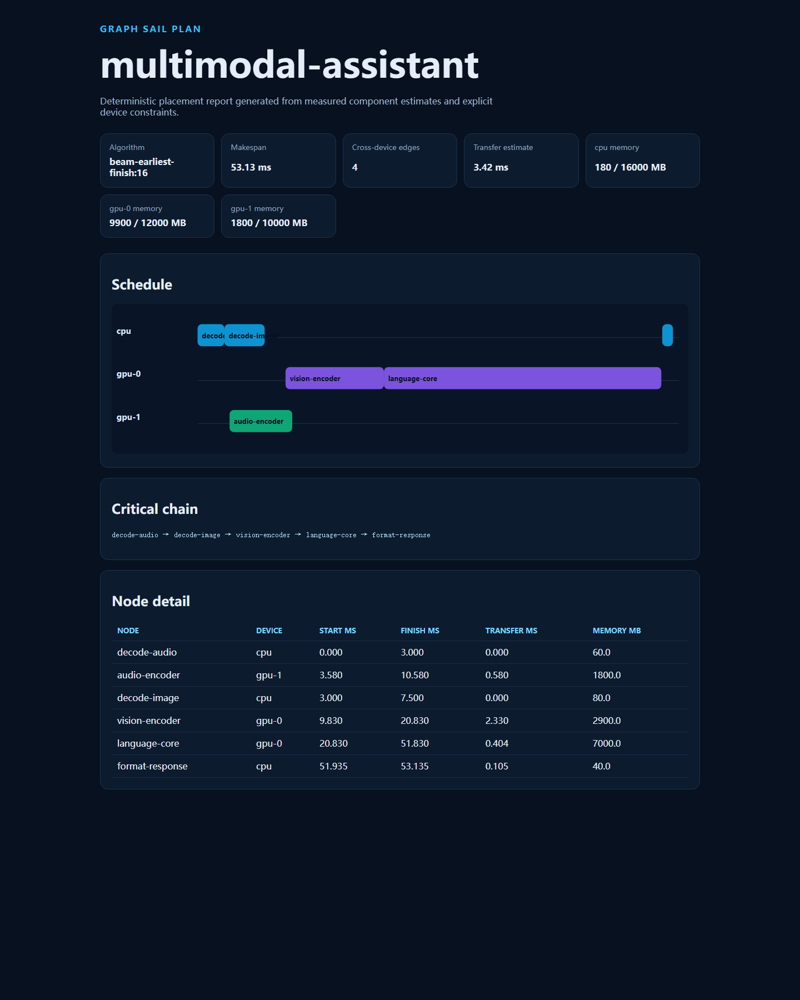

# Graph Sail

**Deterministic placement and scheduling for heterogeneous multimodal component graphs.**

[](https://github.com/appleweiping/graph-sail/actions/workflows/ci.yml)
[](https://www.python.org/)
[](LICENSE)

Modern multimodal applications are not a single model call. Image decoding, vision encoding, audio
encoding, language generation, and output formatting have different memory, latency, and hardware
constraints. Graph Sail turns those explicit estimates into a reproducible placement, schedule, and
decision trace—without downloading a model or touching a cluster.

The project is useful when you need to answer:

- Can all components fit in the available device memory?
- Which cross-device edges dominate the estimate?
- Would a fast local choice block a later pinned component?
- Why was one accelerator selected and another rejected?
- What should be measured before moving from a sketch to a deployment benchmark?

## Demo

```text
$ graph-sail demo --output examples/demo-output --write-input
planned 6 nodes in 53.135 ms
  decode-audio             -> cpu
  audio-encoder            -> gpu-1
  decode-image             -> cpu
  vision-encoder           -> gpu-0
  language-core            -> gpu-0
  format-response          -> cpu
```

Open the checked-in [interactive report](examples/demo-output/report.html), inspect the
[machine-readable plan](examples/demo-output/plan.json), or regenerate both locally. The report is
self-contained and loads no remote scripts, fonts, or analytics.



## Features

- Strict, typo-resistant JSON input contract.
- Image, audio, language, decoder, post-processing, or custom node kinds.
- Per-device latency estimates, persistent memory budgets, allowlists, and pinned nodes.
- Directed link bandwidth and fixed-latency estimates with explicit fallbacks.
- Stable topological ordering and concrete cycle diagnostics.
- Fast deterministic greedy planner.
- Bounded beam search that can preserve memory for later constrained components.
- Candidate-by-candidate explanations for every placement.
- Critical-chain, utilization, transfer, and memory summaries.
- JSON, Graphviz DOT, and responsive standalone HTML reports.
- Standard-library runtime: no GPU, model weights, service, or network access required.

## Installation

Graph Sail requires Python 3.11 or newer.

```bash
git clone https://github.com/appleweiping/graph-sail.git
cd graph-sail
python -m venv .venv
# Linux/macOS: source .venv/bin/activate
# Windows: .venv\Scripts\activate
python -m pip install -e .
```

For development tools:

```bash
python -m pip install -e ".[dev]"
```

## Quick start

Validate a graph before planning:

```bash
graph-sail validate examples/demo-output/graph.json
```

Run the beam planner and write a report bundle:

```bash
graph-sail plan examples/demo-output/graph.json --algorithm beam --beam-width 16 --output my-plan
```

Use `--algorithm greedy` for the fastest deterministic baseline.

## Input at a glance

```json
{
  "name": "image-to-text",
  "devices": [
    {"name": "cpu", "memory_mb": 16000, "kinds": ["decode"]},
    {"name": "gpu", "memory_mb": 12000, "kinds": ["vision", "language"]}
  ],
  "nodes": [
    {"id": "decode", "kind": "decode", "memory_mb": 80, "latency_ms": {"cpu": 4}},
    {"id": "vision", "kind": "vision", "memory_mb": 2900, "latency_ms": {"gpu": 11}},
    {"id": "answer", "kind": "language", "memory_mb": 7000, "latency_ms": {"gpu": 31}}
  ],
  "edges": [
    {"source": "decode", "target": "vision", "payload_mb": 18},
    {"source": "vision", "target": "answer", "payload_mb": 12}
  ]
}
```

See the complete [graph-format reference](docs/graph-format.md).

## Python API

```python
from graph_sail import BeamPlanner, load_graph
from graph_sail.report import write_report_bundle

graph = load_graph("examples/demo-output/graph.json")
plan = BeamPlanner(beam_width=16).plan(graph)

print(plan.placements)
print(f"estimated makespan: {plan.makespan_ms:.2f} ms")
write_report_bundle(graph, plan, "my-plan")
```

Public input models and result records use frozen dataclass shells. Their tuple fields cannot be
reassigned, while JSON-shaped mapping fields such as latency profiles and memory summaries remain
ordinary dictionaries and should be treated as read-only. `PlanResult.to_dict()` returns a fresh,
stable JSON-ready object suitable for CI snapshots or downstream tooling.

## How planning works

Graph Sail first validates the document and computes a lexicographically stable topological order.
For each node, it evaluates static compatibility, remaining persistent memory, predecessor readiness,
cross-device transfer, and device availability.

The greedy planner selects the earliest-finishing candidate immediately. The beam planner keeps a
bounded set of alternatives, which lets it avoid cases where a fast early placement consumes memory
needed by a later pinned node. Both planners keep the stable topological ready-node order fixed: beam
search explores device placements, not alternative valid execution orders for independent nodes.
Consequently, a plan is deterministic and feasible under the model but is not an optimized task-order
schedule. The full cost model and complexity are documented in [architecture.md](docs/architecture.md).

## Interpreting results responsibly

Graph Sail plans from numbers you provide. It does not benchmark hardware and its output is not a
throughput or service-level guarantee. Current schedules assume one node at a time per device,
persistent component memory, and non-contended transfers. Dynamic batching, kernels that overlap,
shared tenancy, power limits, and network contention require measurement or a richer simulator.

The decision trace is designed to expose these assumptions instead of hiding them behind a single
score.

## Development

```bash
python -m ruff check src tests
python -m ruff format --check src tests
python -m coverage run -m pytest
python -m coverage report
```

The suite covers parsing, graph validation, cycle diagnostics, transfer estimates, memory constraints,
greedy dead ends, beam recovery, deterministic output, report escaping, and CLI behavior on CPU.

See [CONTRIBUTING.md](CONTRIBUTING.md), [SECURITY.md](SECURITY.md), and the
[code of conduct](CODE_OF_CONDUCT.md) before contributing.

## License

Graph Sail is released under the [MIT License](LICENSE).
