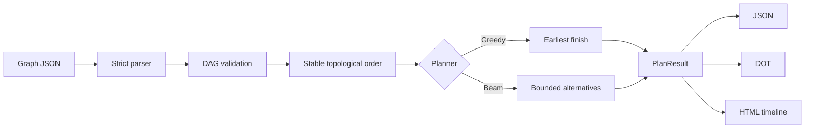

# Architecture

Graph Sail separates a logical component graph from a small physical cost model. The separation is
deliberate: applications can describe a vision encoder, audio encoder, language core, decoder, or
custom component without importing the model implementation.

## Logical model

A node has a stable ID, a semantic kind, persistent memory, and a measured or estimated latency for
each device on which it can run. An edge declares precedence and an estimated payload size. Payload
sizes matter only when an edge crosses devices.

Devices provide a persistent memory budget and an optional set of supported node kinds. Directed
links can override bandwidth and fixed latency for a device pair. Missing links use the graph's
explicit default values.

The parser rejects ambiguous documents: duplicate IDs and edges, unknown fields, invalid endpoint
references, cycles, non-finite numbers, or nodes with no statically compatible device.

## Schedule model

The current model intentionally makes a few conservative assumptions:

1. Component memory stays resident for the plan's lifetime.
2. One device executes one node at a time.
3. A node starts after its device is free and every predecessor result has arrived.
4. Transfers do not reserve a shared link resource; independent transfers may overlap.
5. Node latency is a caller-provided estimate and does not change with batching or contention.
6. Ready nodes follow one lexicographically stable topological order. Planners do not reorder
   independent nodes to shorten the critical path.

These assumptions make the result easy to audit. They also define the limits of the estimate. A
production deployment with overlapped kernels, shared accelerators, dynamic batching, or contested
links should feed measured latency into a richer simulator before provisioning hardware.

## Planners

`GreedyPlanner` evaluates every compatible device and chooses the candidate with the earliest finish
time. Ties are broken by start time and device name. It is fast but can consume memory needed by a
later pinned node.

`BeamPlanner` retains a bounded number of partial placements. Each level is ranked by current
makespan, sum of finish times, and a stable placement tuple. It can avoid common greedy dead ends
without pretending to be a globally optimal mixed-integer solver. It searches placements only; the
ready-node order remains fixed.

The planner prebuilds node and link indexes and sorts the device inventory once. Candidate evaluation
across a DAG with `N` nodes, `E` edges, `D` devices, and beam width `B` is approximately
`O(B × D × (N + E))`. The current immutable partial states copy schedules, maps, and decision tuples
when expanded, adding up to `O(B × D × N²)` work across all levels; ranking adds roughly
`O(N × B × D log(B × D))`, with longer tuple comparisons in tie-heavy cases. Peak transient memory
is proportional to the expanded `B × D` states and their partial-plan size. This implementation is
intended for component DAGs, not million-node workflow scheduling.

## Decision trace

Every node records all candidate devices. Rejected candidates state whether the cause was kind,
allowlist, pinning, missing latency, or memory. Feasible candidates include start, finish, and
incoming-transfer estimates. The report can therefore answer both “where was this placed?” and “why
was the alternative rejected?”
