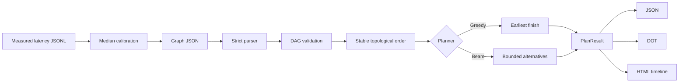

# Architecture

Graph Sail separates a logical component graph from a small physical cost model. The separation is
deliberate: applications can describe a vision encoder, audio encoder, language core, decoder, or
custom component without importing the model implementation.



## Logical model

A node has a stable ID, a semantic kind, persistent memory, and a measured or estimated latency for
each device on which it can run. An edge declares precedence and an estimated payload size. Payload
sizes matter only when an edge crosses devices.

Devices provide a persistent memory budget and an optional set of supported node kinds. Directed
links can override bandwidth and fixed latency for a device pair. Missing links use the graph's
explicit default values.

The parser rejects ambiguous documents: duplicate IDs and edges, unknown fields, invalid endpoint
references, cycles, non-finite numbers, or nodes with no statically compatible device.

## Schedule model

The current model intentionally makes a few conservative assumptions:

1. Component memory stays resident for the plan's lifetime.
2. One device executes one node at a time.
3. A node starts after its device is free and every predecessor result has arrived.
4. Transfers do not reserve a shared link resource; independent transfers may overlap.
5. Node latency is a caller-provided isolated estimate. It is used unchanged unless the document
   opts in to a latency model below, which rescales it from caller-supplied parameters.
6. Ready nodes follow one lexicographically stable topological order. Planners do not reorder
   independent nodes to shorten the critical path.

These assumptions make the result easy to audit. They also define the limits of the estimate. A
production deployment with overlapped kernels, contested links, or power limits should feed measured
latency into a richer simulator before provisioning hardware.

## Latency models

A device or node may declare one small, explicit model that rescales the caller's isolated estimate.
Both models are opt-in and off by default: a document that declares neither produces exactly the plan
Graph Sail produced before they existed. Neither model measures anything. Each takes numbers the
caller fitted elsewhere and applies them arithmetically, so the result is an estimate of an estimate
and should be read that way.

### Device contention

A device may declare a linear co-residency slowdown:

```json
{"name": "gpu-0", "memory_mb": 12000, "contention": {"slowdown_per_cotenant": 0.12,
 "max_cotenants": 3}}
```

When a node is placed on that device, its compute estimate is multiplied by

```
factor = 1 + slowdown_per_cotenant × min(cotenants, max_cotenants)
```

where `cotenants` is the number of components already resident on that device. This follows the
model's own timeline: component memory is persistent (assumption 1) and a device runs one node at a
time (assumption 2), so the k-th node scheduled on a device begins after the previous k−1 have been
loaded and is charged for exactly those k−1 neighbours. The count is a plan quantity, not a wall
clock one, so the factor is reproducible.

The linear form is the first-order approximation used by interference-aware placement work: each
additional co-resident tenant removes a roughly constant share of the cache, memory bandwidth, and
scheduling capacity the isolated measurement enjoyed. It is deliberately the simplest defensible
shape. `max_cotenants` states the co-residency count above which the caller's fit is no longer
claimed to hold, so the model saturates rather than extrapolating a straight line indefinitely.

What it does not model: which tenants interfere (a compute-bound and a bandwidth-bound neighbour are
charged alike), asymmetric or pairwise interference, contention from work outside the graph, and any
non-linearity such as a cache cliff. A device with a `slowdown_per_cotenant` of `0` declares a
measured absence of interference and behaves exactly like a device with no model at all.

### Request batching

A node may declare a request batch:

```json
{"id": "language-core", "kind": "language", "memory_mb": 7000,
 "latency_ms": {"gpu-0": 31.0}, "batch": {"size": 4, "window_ms": 2.0, "fixed_fraction": 0.6}}
```

The declaration asserts two things the caller established elsewhere: that `size` requests accumulate
within `window_ms`, and that `fixed_fraction` of the isolated estimate is per-invocation overhead a
batch amortises. Graph Sail then applies the usual affine batch cost `T(b) = α + βb`,
re-parameterised so it reproduces the caller's own single-request number:
`α = fixed_fraction × latency_ms` and `β = (1 − fixed_fraction) × latency_ms`, so `T(1)` is exactly
`latency_ms`. The modelled per-request compute is `T(size) / size`, so the estimate is multiplied by

```
factor = 1 − fixed_fraction × (1 − 1 / size)
```

`window_ms` is the latency side of that trade: the node cannot start until its inputs have been ready
for `window_ms`, which is what waiting for a batch to fill costs. As everywhere else in this model,
idle device time before a node is not backfilled by other work. A batch of size 1, or a
`fixed_fraction` of 0, gives a factor of exactly 1 and leaves the estimate untouched.

What it does not model: request arrival. Graph Sail has no arrival process and no queue occupancy, so
it cannot tell you whether `size` requests really do appear within `window_ms` — the caller asserts
that and owns the assertion. Padding waste on ragged batch shapes, memory growth with batch size
(declared `memory_mb` is unchanged), per-device batch limits, and throughput are all outside the
model. A batched plan is still a latency estimate for one request under a declared batch, never a
throughput figure.

When a device declares contention and a node declares a batch, the two multipliers compose, and the
product is recorded per scheduled node as `latency_scale`.

## Planners

`GreedyPlanner` evaluates every compatible device and chooses the candidate with the earliest finish
time. Ties are broken by start time and device name. It is fast but can consume memory needed by a
later pinned node.

`BeamPlanner` retains a bounded number of partial placements. Each level is ranked by current
makespan, sum of finish times, and a stable placement tuple. It can avoid common greedy dead ends
without pretending to be a globally optimal mixed-integer solver. It searches placements only; the
ready-node order remains fixed.

The planner prebuilds node and link indexes and sorts the device inventory once. Candidate evaluation
across a DAG with `N` nodes, `E` edges, `D` devices, and beam width `B` is approximately
`O(B × D × (N + E))`. The current immutable partial states copy schedules, maps, and decision tuples
when expanded, adding up to `O(B × D × N²)` work across all levels; ranking adds roughly
`O(N × B × D log(B × D))`, with longer tuple comparisons in tie-heavy cases. Peak transient memory
is proportional to the expanded `B × D` states and their partial-plan size. This implementation is
intended for component DAGs, not million-node workflow scheduling.

## Decision trace

Every node records all candidate devices. Rejected candidates state whether the cause was kind,
allowlist, pinning, missing latency, or memory. Feasible candidates include start, finish, and
incoming-transfer estimates. The report can therefore answer both “where was this placed?” and “why
was the alternative rejected?”

## Experimental boundary

Calibration is a separate pure transformation before planning. It replaces only explicitly observed
node/device latency cells and emits both a complete graph and aggregate provenance. Benchmarking then
compares planner decision quality (estimated makespan) separately from planner runtime. See
[calibration-and-benchmarks.md](calibration-and-benchmarks.md) for the contract and reporting protocol.
